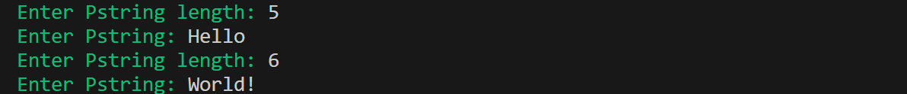
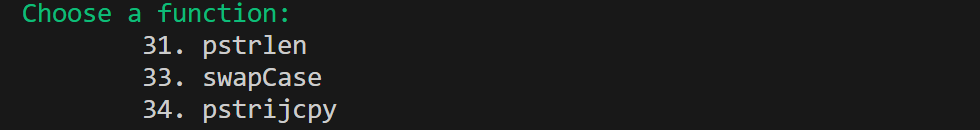

  


# String Play 🔠

🔤 A simple project performing various string operations implemented in assembly

## Table of Contents

1. [About](#about)  
2. [Features](#features)  
3. [Requirements](#requirements)  
4. [Installation](#installation)  
5. [Usage](#usage)  

---

## About

This repository contains a simple project performing various string operations on custom Pstrings implemented in x86-64 Assembly.  
The project demonstrates basic Assembly programming concepts including function calls, loops, and conditional branching, with an interactive terminal interface

---

## Features

- Calculate the length of Pstrings  
- Swap the case of letters in a string  
- Copy slices of strings between Pstrings  
- Interactive terminal interface with colored output

---

## Requirements

- A Linux or Windows system with an x86-64 environment  
- GCC (GNU Compiler) to assemble and link the program

---

## Installation
Follow these steps to set up the project locally:

---

### 1. Clone the repository
```bash
git clone https://github.com/Amit-Bruhim/String-Play.git
```
### 2. Navigate into the src folder
```bash
cd String-Play/src
```
### 3. Compile the program using Make
```bash
make
```
### 4. Run the main program
```bash
./pstrings
```

---

## Usage

When you run the program, you will first be prompted to enter **two Pstrings** and their lengths.  
For all the examples below, we will use the following inputs:  

1. First Pstring: `Hello`
2. Second Pstring: `World!`

As shown here:

  

After entering the strings, the following menu will appear:  



Choose:  
* A number from the menu to select a function  
* Any other input will display an error message


### Examples

#### Example 1: Pstring Length – pstrlen

The program will output the lengths of the two Pstrings:


---

#### Example 2: Swap Case – swapCase

The program will swap the case of letters in both Pstrings:


---

#### Example 3: Copy Slice – pstrijcpy

The program will ask for the **start and end indices** of the slice to copy from the second Pstring to the first.  
For example, copying indices 1 to 3 from `World!` to `Hello`:


